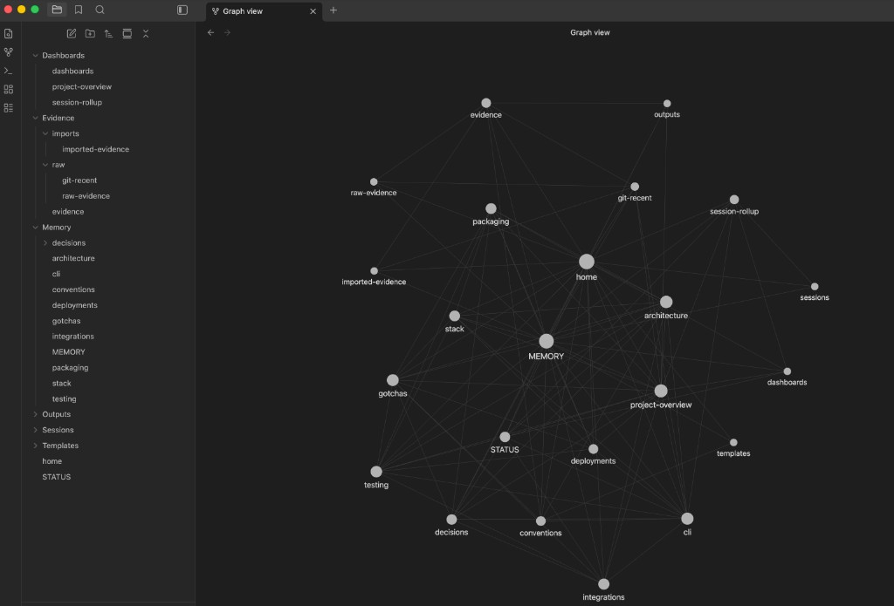

# agent-knowledge

Persistent, file-based project memory for AI coding agents.

One command gives any project a knowledge vault that agents read on startup,
maintain during work, and carry across sessions -- no database, no server,
just markdown files and a CLI.

<p align="center">
  
  <br />
  <em>Project knowledge graph viewed in Obsidian</em>
</p>

## Install

```
pip install agent-knowledge
```

## Quick Start

```
cd your-project
agent-knowledge init
```

Open Cursor, Claude, or Codex in the repo -- the agent picks up from there.

`init` automatically:
- infers the project slug from the directory name
- creates an external knowledge vault at `~/agent-os/projects/<slug>/`
- symlinks `./agent-knowledge` into the repo as the local handle
- detects Cursor, Claude, and Codex and installs integration files
- bootstraps the memory tree and marks onboarding as `pending`
- prints the prompt to kick off first-time agent ingestion

## How It Works

```
your-project/
  .agent-project.yaml        # project config
  AGENTS.md                   # instructions agents read on startup
  agent-knowledge/            # symlink -> ~/agent-os/projects/<slug>/
    STATUS.md                 # onboarding state + sync timestamps
    Memory/                   # curated, durable knowledge (source of truth)
    Evidence/                 # imported/extracted material
    Outputs/                  # generated views (never canonical)
    Sessions/                 # ephemeral session state
    Dashboards/               # rollup views
```

Knowledge lives **outside** the repo so it persists across branches, tools,
and clones. The symlink gives every tool a stable `./agent-knowledge` path.

When an agent opens the repo it reads `AGENTS.md` and `STATUS.md`.
If onboarding is pending, it inspects the project, imports evidence,
and writes curated memory. After that, maintenance is automatic.

## Commands

| Command | What it does |
|---------|-------------|
| `init` | Set up a project (zero-arg, auto-detects everything) |
| `sync` | Push memory updates + extract git evidence |
| `doctor` | Validate setup and report health |
| `update` | Sync project changes into the knowledge tree |
| `import` | Import repo history into Evidence/ |
| `ship` | Validate, sync, commit, push |
| `setup` | Install global Cursor rules and skills |
| `global-sync` | Import safe local tooling config |
| `measure-tokens` | Estimate context token savings |

All write commands support `--dry-run`. Use `--json` for machine-readable output.

## Multi-Tool Support

`init` detects which tools are present and installs the right bridge files:

| Tool | Bridge file | How it works |
|------|-------------|-------------|
| Cursor | `.cursor/hooks.json` + `.cursor/rules/agent-knowledge.mdc` | Hook runs on save; rule loads on session start |
| Claude | `CLAUDE.md` | Points to AGENTS.md and STATUS.md |
| Codex | `.codex/AGENTS.md` | Points to AGENTS.md and STATUS.md |

Multiple tools in the same repo work together.

## Obsidian

Open `~/agent-os/projects/<slug>/` as an Obsidian vault. The knowledge graph
shows all memory areas, evidence, and dashboards connected through wiki-links.

Enable **Graph view** in Settings > Core plugins and set
**Files and links > Use `[[Wikilinks]]`** to ON for the best experience.

## Custom Knowledge Home

```bash
export AGENT_KNOWLEDGE_HOME=~/my-knowledge
agent-knowledge init
```

## Development

```bash
git clone <repo-url>
cd agent-knowledge
python -m venv .venv && source .venv/bin/activate
pip install -e ".[dev]"
python -m pytest tests/ -q
```
